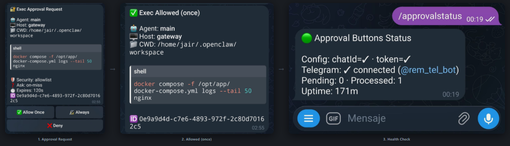

# 🔐 Telegram Approval Buttons for OpenClaw

> One-tap `exec` approvals in Telegram — no more typing `/approve <uuid> allow-once`.

## What does this look like?

<p align="center">
  
</p>

## What does this do?

OpenClaw's Discord has built-in approval buttons. **Telegram doesn't** — you're stuck typing long `/approve` commands. This plugin fixes that.

**Features:**
- ✅ **One-tap approvals** — Allow Once · 🔏 Always · ❌ Deny
- 🔄 **Auto-resolve** — edits the message after decision (removes buttons, shows result)
- ⏰ **Expiry handling** — stale approvals auto-cleaned and marked as expired
- 🩺 **Self-diagnostics** — `/approvalstatus` checks health and stats
- 🛡️ **Graceful fallback** — if buttons fail, the original text goes through
- 📦 **Zero dependencies** — uses only Node.js built-in `fetch`

## Quick Start

### Step 1: Download the plugin

```bash
git clone https://github.com/JairFC/openclaw-telegram-approval-buttons.git
```

### Step 2: Add to your config

Open your `openclaw.json` and add this block. If the `"plugins"` section already exists, just merge the contents:

```jsonc
{
  "plugins": {
    "load": {
      "paths": ["/path/to/openclaw-telegram-approval-buttons"]
    },
    "entries": {
      "telegram-approval-buttons": {
        "enabled": true
      }
    }
  }
}
```

> 💡 **Replace `/path/to/`** with the actual path where you cloned the repo.  
> Example: `"~/Projects/openclaw-telegram-approval-buttons"`

### Step 3: Restart and verify

```bash
openclaw gateway restart
```

Then send `/approvalstatus` in your Telegram chat. You should see:

```
🟢 Approval Buttons Status

Config: chatId=✓ · token=✓
Telegram: ✓ connected (@your_bot)
Pending: 0 · Processed: 0
Uptime: 1m
```

**That's it!** Next time the AI triggers an `exec` approval, you'll get buttons.

## Prerequisites

- **OpenClaw ≥ 2026.2.9** installed and running
- **Node.js ≥ 22** (uses built-in `fetch`)
- **Telegram configured** in your `openclaw.json`
- **Exec approvals enabled** — `tools.exec.ask` must NOT be `"off"`

## How it works

```
┌─────────────┐    message_sending     ┌──────────────────┐
│  OpenClaw    │ ── approval text ──→  │     Plugin        │
│  Gateway     │                       │                   │
│              │   cancel original     │  1. Parse text    │
│              │ ←──────────────────── │  2. Send buttons  │
└─────────────┘                        │  3. Track pending │
                                       └────────┬─────────┘
                                                │
                                    Telegram Bot API
                                                │
                                       ┌────────▼─────────┐
                                       │   Telegram Chat   │
                                       │                   │
                                       │  🔐 Exec Approval │
                                       │  [✅ Allow] [🔏]  │
                                       │  [❌ Deny]        │
                                       └──────────────────┘
```

When you tap a button, OpenClaw converts the `callback_data` into a synthetic text message — **no webhook needed**.

## Configuration

The plugin **auto-detects** `botToken` and `chatId` from your Telegram channel config. Most setups need zero extra configuration.

### Config resolution order

| Setting    | Priority 1 (explicit)       | Priority 2 (shared config)         | Priority 3 (env)          |
|------------|-----------------------------|------------------------------------|---------------------------|
| `botToken` | `pluginConfig.botToken`     | `channels.telegram.token`          | `TELEGRAM_BOT_TOKEN`      |
| `chatId`   | `pluginConfig.chatId`       | `channels.telegram.allowFrom[0]`   | `TELEGRAM_CHAT_ID`        |

### Advanced options

```jsonc
{
  "plugins": {
    "entries": {
      "telegram-approval-buttons": {
        "enabled": true,
        "config": {
          "chatId": "123456789",       // Override auto-detected chat ID
          "botToken": "123:ABC...",     // Override auto-detected bot token
          "staleMins": 10,             // Minutes before stale cleanup (default: 10)
          "verbose": false             // Diagnostic logging (default: false)
        }
      }
    }
  }
}
```

## FAQ

**Q: I installed the plugin but no buttons appear.**  
A: Make sure `tools.exec.ask` is NOT set to `"off"` in your config. If it's `"off"`, there are no approvals to buttonize. Set it to `"on-miss"` or `"always"`.

**Q: How do I find my Telegram Chat ID?**  
A: Send `/start` to [@userinfobot](https://t.me/userinfobot) on Telegram — it replies with your ID. Alternatively, check `https://api.telegram.org/bot<TOKEN>/getUpdates` after sending a message to your bot.

**Q: Do I need to set up a webhook?**  
A: No! OpenClaw's Telegram integration automatically converts button taps into synthetic text messages. No extra setup needed.

**Q: What happens if the plugin fails to send buttons?**  
A: The original plain-text approval message goes through normally. The plugin never blocks approvals.

**Q: Does this work in group chats?**  
A: Yes, but the bot needs to be an admin or it needs permission to edit its own messages.

## Troubleshooting

| Problem | Fix |
|---------|-----|
| No buttons appear | Check `tools.exec.ask` is not `"off"`. Run `/approvalstatus` to check config. |
| Buttons show but nothing happens | Bot needs message editing permission. Use a private chat or make bot admin. |
| `/approvalstatus` says "token=✗" | Set `botToken` in plugin config, or check `channels.telegram.token`. |
| `/approvalstatus` says "chatId=✗" | Set `chatId` in plugin config, or add your ID to `channels.telegram.allowFrom`. |
| Buttons say "expired" | Approval timed out before you tapped. Adjust `staleMins` if needed. |

## Architecture

```
telegram-approval-buttons/
├── index.ts                  # Entry point — orchestration only
├── types.ts                  # Shared TypeScript interfaces
├── lib/
│   ├── telegram-api.ts       # Telegram Bot API client (isolated)
│   ├── approval-parser.ts    # Parse OpenClaw approval text format
│   ├── message-formatter.ts  # HTML formatting for Telegram messages
│   ├── approval-store.ts     # In-memory pending approval tracker
│   └── diagnostics.ts        # Config resolution, health checks
├── openclaw.plugin.json      # Plugin manifest
└── package.json
```

## Contributing

Issues and PRs welcome. Each file in `lib/` is self-contained with a single responsibility.

## License

[MIT](LICENSE)
